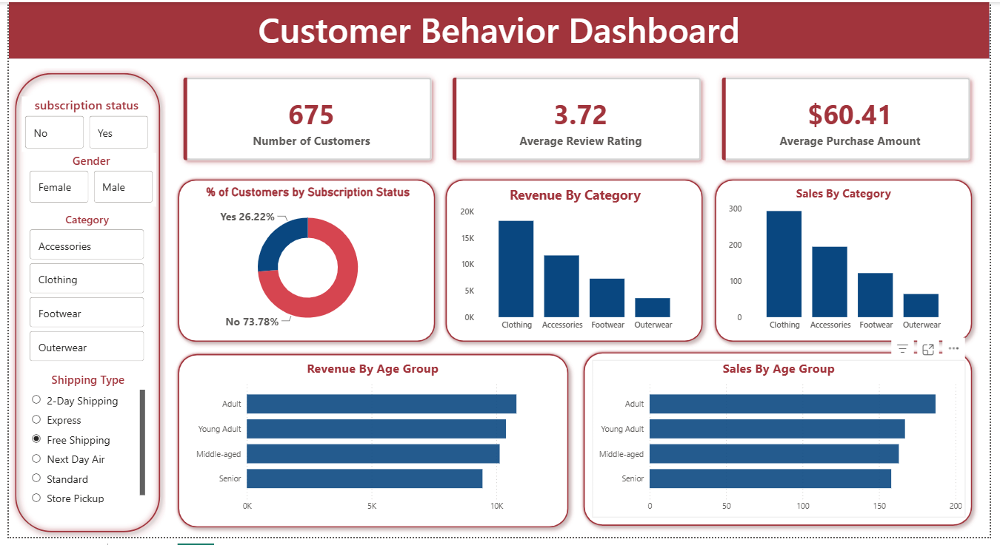

# 📊 Customer Behavior Analysis Dashboard

### 📖 Description

An end-to-end data analytics project developed using **Python**, **MySQL**, and **Power BI** to analyze customer behavior, purchasing patterns, and business performance. The project transforms raw customer data into actionable insights through data preprocessing, SQL analysis, and interactive dashboards.

---

## 📸 Dashboard Preview

  

---

## 📌 Project Overview

This project demonstrates a complete data analytics workflow, showcasing how raw customer data can be transformed into meaningful business insights to support data-driven decision-making.

### 🚀 Project Workflow

✅ **Data Preparation & Exploratory Data Analysis (Python)**
- Loaded, cleaned, and transformed the customer dataset.
- Performed feature engineering and exploratory data analysis (EDA).
- Prepared the data for database storage and visualization.

✅ **Database Management & Analysis (MySQL)**
- Stored the processed dataset in MySQL.
- Executed SQL queries to analyze customer demographics, purchasing behavior, revenue trends, and customer segments.

✅ **Data Visualization & Business Insights (Power BI)**
- Built an interactive dashboard with KPIs, charts, and slicers.
- Visualized customer behavior, sales performance, revenue trends, subscription status, and review ratings.

✅ **Reporting & Business Recommendations**
- Summarized key findings and business insights.
- Presented results through an interactive Power BI dashboard to support strategic decision-making.
